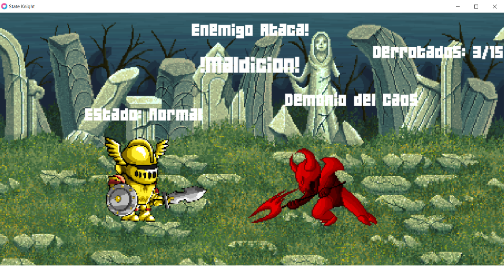

# StateKnight

This is a randomness based videogame about the adventures of a knight.

The knight changes states based on the model of a finite state machine, receiving enemy attacks as inputs.

The finite state machine is implemented using two bi-dimensional arrays which can be found at the beginning of the *Knight.lua* file.

At the moment the game doesn't provide much interaction since it's main focus is to showcase the finite state machine model.

- Character and scenery models were obtained from [craftpix](https://craftpix.net/).
- Game sounds were obtained from [freesound.org](https://freesound.org/).
- Made with the [LÖVE 2D](https://love2d.org/) framework.